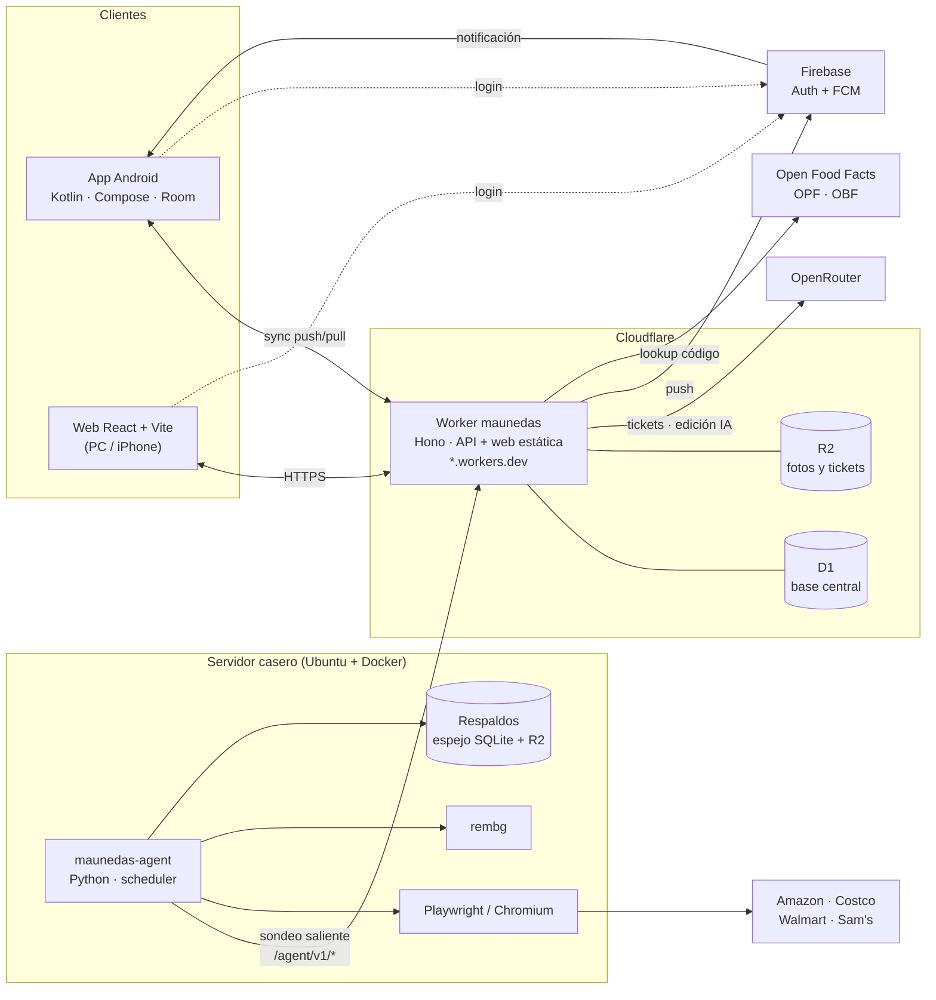

# Arquitectura — Ahorrando Maunedas

> Versión de diseño v1 · 2026-09-30 · Estado: aprobada; pendiente de spikes (ver ESTADO.md).
> Esquema de datos: [`esquema-d1.sql`](./esquema-d1.sql). Diseño detallado para implementar: [`sdd/`](./sdd/README.md).
> Este documento es la vista general; si algo difiere del SDD, **manda el SDD**.

## 1. Vista general



Principio rector: **Cloudflare es el sistema; la casa es un trabajador**. App y web solo hablan con el Worker. El servidor casero nunca recibe conexiones: sondea al Worker, hace lo pesado y devuelve resultados. Si la casa se apaga, solo se pausan el tracking web, la mejora de fotos y los respaldos.

## 2. Componentes

| Componente | Tecnología | Responsabilidad |
|---|---|---|
| `apps/api` | Cloudflare Worker, Hono, Drizzle (D1), Zod ≥ 4.5, `jose` | API REST, sync, auth, motor de alertas, gateway de IA, FCM, lookup de códigos, sirve la web (Workers Static Assets) |
| D1 `maunedas` | SQLite gestionado | Base central única |
| R2 `maunedas-images` | Object storage privado | Originales, máscaras, renders y miniaturas; fotos de tickets |
| `apps/android` | Kotlin, Compose, Room, WorkManager, Hilt, CameraX, ML Kit (códigos, escáner de documentos, segmentación), Coil, Firebase Auth/Messaging | App principal, offline-first |
| `apps/web` | React, TypeScript, Vite, React Router, TanStack Query, Firebase Auth JS | Web responsive (también es "la app" en iPhone). Online en MVP |
| `agent/` | Python 3.12, httpx, selectolax, Playwright, rembg (onnxruntime CPU), SQLite, APScheduler o bucle propio | Scraping programado, quitar fondo, respaldos. Contenedor en el Docker Compose del servidor |
| `packages/shared` | TypeScript | Esquemas Zod de DTOs, unidades y normalización, constantes (UUIDv5 namespaces) |
| `fixtures/` | JSON | Vectores de prueba compartidos por TS, Kotlin y Python |

## 3. Modelo de dominio

```
Categoría (jerárquica) ─┐
Etiquetas ──────────────┤
                        ▼
                    Producto  "Leche Lala Entera"   (marca distinta = producto distinto)
                        │ 1..n
                        ▼
                    Variante  "1 L" · "1.5 L" · "6 × 1 L"
                     │    │    │
         códigos ◄───┘    │    └───► listings (URLs por tienda) ──► listing_state
                          │                                  └──► price_observations (web)
                          ├──► purchase_items (líneas de ticket) ◄── purchases (ticket)
                          └──► price_observations (anaquel)
                                   ▲
                    promotions ────┘ (de compra, línea u observación)
```

### 3.1 Normalización de precio

Toda variante declara `measure` (`mass` | `volume` | `count`), `unit_amount` en unidad base (g, ml, pz) y `pack_count`. El precio por unidad base es:

```
centavos_por_base = pagado_en_centavos / (cantidad × unit_amount × pack_count)
```

El producto elige su unidad de despliegue (`kg`, `100g`, `L`, `100ml`, `pz`). Solo se redondea al mostrar.

| Caso | Variante | Pagado | Cálculo | Se muestra |
|---|---|---|---|---|
| Leche 1 L | volume, 1000, ×1 | $28.50 | 2850 / 1000 = 2.85 ¢/ml | **$28.50 / L** |
| Leche 6 × 1 L | volume, 1000, ×6 | $159.00 | 15900 / 6000 = 2.65 ¢/ml | **$26.50 / L** |
| Jitomate a granel | mass, 1000, ×1, `sold_by_weight` | 0.845 kg → $27.80 | 2780 / 845 = 3.29 ¢/g | **$32.90 / kg** |
| Detergente 3 L, 2x1 | volume, 3000, ×1 | 2 × $89 − $89 = $89 | 8900 / 6000 = 1.48 ¢/ml | **$14.83 / L** (efectivo) |

```ts
// packages/shared/src/pricing/units.ts
export type Measure = 'mass' | 'volume' | 'count';
export type DisplayUnit = 'kg' | '100g' | 'L' | '100ml' | 'pz';

const BASE_PER_DISPLAY: Record<DisplayUnit, { measure: Measure; base: number }> = {
  kg: { measure: 'mass', base: 1000 },
  '100g': { measure: 'mass', base: 100 },
  L: { measure: 'volume', base: 1000 },
  '100ml': { measure: 'volume', base: 100 },
  pz: { measure: 'count', base: 1 },
};

/** Centavos por g / ml / pz. Sin redondeo. */
export function centsPerBase(paidCents: number, quantity: number, unitAmount: number, packCount: number): number {
  const base = quantity * unitAmount * packCount;
  if (!(base > 0)) throw new RangeError('Contenido base inválido');
  return paidCents / base;
}

/** Centavos por unidad de despliegue, redondeado. Lanza si la medida no coincide. */
export function displayCents(cpb: number, measure: Measure, unit: DisplayUnit): number {
  const d = BASE_PER_DISPLAY[unit];
  if (d.measure !== measure) throw new TypeError(`${unit} no aplica a ${measure}`);
  return Math.round(cpb * d.base);
}
```

`fixtures/normalizacion.json` contiene los casos de la tabla (y más). La implementación Kotlin (`core/pricing/Units.kt`) y la Python del agente deben pasar los mismos vectores.

### 3.2 Compras y promociones

- Una compra = un ticket completo (`purchases`) con líneas (`purchase_items`).
- Cada línea guarda `unit_price_cents` (lista), `gross_cents`, `discount_cents` y `final_cents` (restricción `final = gross − discount`).
- `promotions` describe **por qué** hubo descuento, de forma genérica (`type` + `params` JSON). Meses sin intereses se registra con `affects_price = 0`.
- Descuentos a nivel ticket (cupón global) viven en la compra; para precio por unidad se prorratean proporcionalmente al `final_cents` de cada línea (cálculo, no se guarda).
- Una línea puede quedar sin `variant_id` (ticket leído pero no vinculado); no entra en historiales hasta vincularse.

### 3.3 Tres fuentes de precio, una vista

`v_price_points` une compras confirmadas, capturas de anaquel y observaciones web con `cents_per_base` ya calculado. Las gráficas y el comparador leen solo de esa vista (en D1 y como `@DatabaseView` en Room). La UI siempre distingue la fuente con color/ícono: **pagado**, **anaquel**, **web**.

## 4. Sincronización offline (Android)

### 4.1 Reglas

1. La UI de Android lee **solo** de Room. La red la tocan únicamente `SyncWorker` y `UploadWorker`.
2. Toda escritura local, en la misma transacción Room, encola `(tabla, id)` en `outbox`.
3. IDs UUIDv7 del cliente; UUIDv5 determinista para `product_tags` y `receipt_aliases`.
4. Conflictos: **last-write-wins por fila** usando `updated_at` del cliente. El servidor limita `updated_at` a `now + 5 min` para que un teléfono con el reloj adelantado no gane para siempre.
5. Borrado = `deleted_at` (tombstone). Nunca DELETE físico en tablas SYNC.
6. El servidor asigna `version` (contador global en `sync_meta`). El cliente nunca la escribe.
7. Columnas que escribe el servidor viven en tablas separadas y de solo bajada (`listing_state`, `alert_events`, `agent_status`) o en filas append-only (`image_renditions`). Así LWW nunca mezcla autores.

### 4.2 Push

```http
POST /v1/sync/push
Authorization: Bearer <Firebase ID token>

{
  "device_id": "0192…",
  "mutations": [
    { "table": "purchases",      "row": { "id": "0192…", "store_id": "…", "updated_at": 1759255200000, … } },
    { "table": "purchase_items", "row": { … } }
  ]
}
→ 200 { "applied": 12, "conflicts": [ { "table": "barcodes", "id": "…", "reason": "BARCODE_TAKEN", "server_row": { … } } ] }
```

- Máximo **100 mutaciones** por request (límite de CPU del plan Free; ver §13).
- El cliente envía en orden de dependencias; además el batch arranca con `PRAGMA defer_foreign_keys = on`.
- Idempotente: reintentar el mismo push no cambia nada (`WHERE excluded.updated_at > t.updated_at`).
- `barcodes` y `receipt_aliases` tienen índices únicos parciales: el servidor revisa colisiones **antes** del batch y las devuelve como conflicto en vez de abortar todo el lote.

```ts
// apps/api/src/sync/push.ts (esqueleto)
app.post('/v1/sync/push', async (c) => {
  const { mutations } = PushSchema.parse(await c.req.json());        // ≤ 100
  const user = c.get('user');
  const now = Date.now();

  const { accepted, conflicts } = await precheckUniques(c.env.DB, mutations); // BARCODE_TAKEN, ALIAS_TAKEN

  const stmts: D1PreparedStatement[] = [
    c.env.DB.prepare('PRAGMA defer_foreign_keys = on'),
    c.env.DB.prepare(`UPDATE sync_meta SET value = value + 1 WHERE key = 'version'`),
  ];
  for (const m of accepted) {
    const t = SYNC_TABLES[m.table];                    // lista blanca de tablas y columnas
    const row = t.sanitize(m.row, user);               // descarta columnas de servidor; fija updated_by
    row.updated_at = Math.min(row.updated_at, now + 5 * 60_000);
    t.assertWritableBy(user, row);                     // p. ej. price_observations solo source='shelf'
    stmts.push(t.upsert(c.env.DB, row));
  }
  await c.env.DB.batch(stmts);                         // transacción

  conflicts.push(...(await staleRows(c.env.DB, accepted)));  // filas donde ganó el servidor
  return c.json({ applied: accepted.length, conflicts });
});
```

Upsert generado por tabla (ejemplo `products`):

```sql
INSERT INTO products (id, name, brand, category_id, display_unit, notes, primary_image_id,
                      created_at, updated_at, deleted_at, updated_by, version)
VALUES (?1, ?2, ?3, ?4, ?5, ?6, ?7, ?8, ?9, ?10, ?11,
        (SELECT value FROM sync_meta WHERE key = 'version'))
ON CONFLICT(id) DO UPDATE SET
  name = excluded.name, brand = excluded.brand, category_id = excluded.category_id,
  display_unit = excluded.display_unit, notes = excluded.notes,
  primary_image_id = excluded.primary_image_id, deleted_at = excluded.deleted_at,
  updated_at = excluded.updated_at, updated_by = excluded.updated_by, version = excluded.version
WHERE excluded.updated_at > products.updated_at;
```

### 4.3 Pull

```http
POST /v1/sync/pull
{ "cursors": { "products": [118, "0192…"], "variants": [118, "0192…"], … }, "limit": 500 }
→ { "changes": { "products": [ … ], … }, "cursors": { … }, "has_more": false }
```

Cada tabla tiene su cursor `(version, id)`. Varias filas comparten `version` (mismo push), por eso el cursor es compuesto:

```sql
SELECT * FROM products
WHERE (version, id) > (?1, ?2)
ORDER BY version, id
LIMIT ?3;
```

`alert_rules` y `alert_events` se filtran por `user_id`; de `users` solo bajan `id, username, display_name, role, active`. Todo lo demás es compartido por el hogar.

### 4.4 Android: outbox y workers

```kotlin
@Entity(tableName = "outbox", indices = [Index(value = ["tableName", "rowId"], unique = true)])
data class OutboxEntry(
    @PrimaryKey(autoGenerate = true) val seq: Long = 0,
    val tableName: String,
    val rowId: String,
    val enqueuedAt: Long,          // REPLACE al re-editar: coalesce de ediciones
)

class PurchaseRepository @Inject constructor(
    private val db: AppDatabase,
    private val clock: Clock,
    private val sync: SyncScheduler,
) {
    suspend fun save(purchase: PurchaseEntity, items: List<PurchaseItemEntity>) = db.withTransaction {
        val now = clock.nowMillis()
        db.purchases().upsert(purchase.copy(updatedAt = now))
        db.purchaseItems().upsertAll(items.map { it.copy(updatedAt = now) })
        db.outbox().enqueue(
            listOf(OutboxEntry(tableName = "purchases", rowId = purchase.id, enqueuedAt = now)) +
            items.map { OutboxEntry(tableName = "purchase_items", rowId = it.id, enqueuedAt = now) }
        )
        sync.requestExpedited()     // OneTimeWorkRequest con NetworkType.CONNECTED
    }
}
```

- `SyncWorker`: toma snapshot `t0`, lee filas actuales de las entradas del outbox (en orden de dependencias), hace push en lotes de 100, borra del outbox las entradas con `enqueuedAt ≤ t0`, luego pull hasta `has_more = false`. Periódico cada 15 min + expedito tras cada escritura.
- En conflicto: se sobrescribe la fila local con `server_row` y, si es visible para el usuario, se muestra un aviso ("Otro dispositivo modificó *Leche Lala 1 L*").
- `BARCODE_TAKEN`: pantalla de resolución — "Este código ya pertenece a *X*. ¿Fusionar tu variante con esa?".
- `UploadWorker`: sube binarios pendientes (tabla local de Room `pending_uploads`) a R2 vía el Worker; hasta entonces las imágenes se leen del almacenamiento local.

### 4.5 Web

Online en el MVP. **Escribe con el mismo `/v1/sync/push`** (una sola ruta de escritura y la misma semántica LWW) y lee con endpoints de consulta (§5). PWA offline queda para la etapa 3.

## 5. API pública (`/v1`)

Base: `https://maunedas.<subdominio>.workers.dev`. Contratos completos, esquemas y códigos de error en [`sdd/03-api.md`](./sdd/03-api.md).

Auth: `Authorization: Bearer <Firebase ID token>` (usuario + contraseña o Google). El Worker valida la firma contra el JWKS de Google (`jose`), `iss`/`aud` del proyecto, y resuelve el usuario por `user_identities` (o vincula Google por `users.google_email`). Detalle en [`sdd/02-autenticacion.md`](./sdd/02-autenticacion.md).

| Grupo | Rutas |
|---|---|
| Público | `GET /v1/health` · `POST /v1/bootstrap` (una sola vez) · proxy `/__/auth/*` |
| Sesión | `GET /v1/me` · `POST /v1/devices` · `DELETE /v1/devices/:id` |
| Sync | `POST /v1/sync/push` · `POST /v1/sync/pull` |
| Consulta | `GET /v1/lookups` · `GET /v1/products` · `GET /v1/products/:id` · `GET /v1/products/:id/compare` · `GET /v1/variants/:id/history` · `GET /v1/search/variants` · `GET /v1/purchases` · `GET /v1/purchases/:id` |
| Códigos | `GET /v1/barcodes/:code` |
| Imágenes | `PUT·GET /v1/images/:id/blobs/:name` · `POST /v1/images/:id/import` · `POST /v1/images/:id/enhance` (E3) · `POST /v1/images/:id/ai-edit` (E3) |
| Tickets | `POST /v1/receipts/extract` |
| Tracking (E2) | `POST /v1/listings/resolve` · `POST /v1/listings/:id/check-now` · `GET /v1/listings` · `GET /v1/alerts/events` |
| Admin | `GET·POST /v1/admin/users` · `PATCH /v1/admin/users/:id` · `POST /v1/admin/users/:id/password` · `POST /v1/admin/merge` · `GET /v1/admin/ai-budget` · `GET /v1/admin/agent` (E2) |

## 6. Agente casero (`/agent/v1`)

Contenedor `maunedas-agent` en el Docker Compose existente (junto a Home Assistant). Auth: `Authorization: Bearer <AGENT_TOKEN>`; el Worker guarda solo el hash. Solo conexiones salientes.

| Método y ruta | Uso |
|---|---|
| `POST /agent/v1/work` | **Un solo sondeo cada 60 s**: cambios de configuración de listings (con intervalo efectivo), solicitudes "revisar ahora", conteo de trabajos de imagen. El cuerpo lleva el heartbeat |
| `POST /agent/v1/observations` | Lote ≤ 20 resultados de scraping |
| `POST /agent/v1/jobs/claim` | Reclama 1 trabajo de imagen (lease de 10 min) |
| `GET /agent/v1/images/:id/original` | Descarga el original |
| `PUT /agent/v1/jobs/:id/result/:kind` | Sube `mask`, `processed` o `thumb`; crea `image_renditions` con `tier='home'` |
| `POST /agent/v1/jobs/:id/complete` · `/fail` | Cierra el trabajo |
| `POST /agent/v1/backup/pull` | Como `/v1/sync/pull` pero sin filtro de usuario y con tablas de servidor necesarias para restaurar |

### 6.1 Ingesta de observaciones (en el Worker)

```
por cada resultado:
  actualizar listing_state (last_checked_at, status, fallas consecutivas, último precio…)
  si status = ok y (precio, stock o promo) ≠ último registrado:
      insertar price_observations (source='web')        ← compresión por cambio
      ctx.waitUntil(evaluarAlertas(observación))
  si status cambia a 'blocked': avisar al admin (FCM)
```

La gráfica dibuja la serie web como **escalones**: cada punto vale hasta el siguiente cambio; `last_checked_at` indica hasta cuándo se confirmó.

### 6.2 Scheduler (SQLite local del agente)

- Tabla local `schedule(listing_id, next_check_at, backoff_level, last_hash)`.
- Cada 30 s elige listings vencidos respetando: concurrencia global 1 para Playwright y 2 para HTTP; **separación mínima por dominio** (p. ej. Amazon 45 s, resto 20 s).
- Próxima revisión = `now + intervalo × aleatorio(0.9, 1.1)`. Intervalo = `listings.check_interval_min` o el default de la tienda (8 h).
- Error: backoff exponencial `base × 2^n`, tope 24 h. Tres detecciones de captcha seguidas → `blocked` (visible en la app).
- "Revisar ahora" se atiende en el siguiente sondeo sin romper la separación por dominio.

### 6.3 Adapters

```python
# agent/maunedas_agent/adapters/base.py
from dataclasses import dataclass, field
from typing import Literal, Protocol

@dataclass
class ScrapeResult:
    status: Literal["ok", "not_found", "blocked", "error"]
    price_cents: int | None = None
    list_price_cents: int | None = None
    in_stock: bool | None = None
    promo_text: str | None = None
    extra: dict = field(default_factory=dict)   # vendedor, envío…
    error: str | None = None

class Adapter(Protocol):
    name: str                    # "amazon_mx"
    domains: tuple[str, ...]     # ("amazon.com.mx",)
    min_spacing_s: int           # separación mínima entre requests al dominio

    def canonicalize(self, url: str) -> tuple[str, str | None]:
        """URL canónica e id externo (ASIN, SKU…)."""

    async def fetch(self, url: str, ctx: "FetchContext") -> ScrapeResult:
        """Estrategia en cascada (abajo)."""
```

Estrategia de extracción, de la más barata a la más cara:

1. **HTTP simple** (httpx, headers de navegador real) + **JSON-LD** `schema.org/Product → offers`.
2. **Estado embebido** en el HTML (`__NEXT_DATA__`, `window.__PRELOADED_STATE__` o similar).
3. Selectores CSS específicos de la tienda.
4. **Playwright** (contexto persistente, bloqueando imágenes, fuentes y media para ahorrar RAM/CPU) solo si 1–3 fallan.

Cada adapter tiene fixtures HTML guardados y tests `pytest`. Ante un fallo de parseo se guarda el HTML (últimos 20) en `/data/snapshots/` para depurar. Algunos precios de Costco, Sam's y Walmart dependen de sucursal o código postal: el adapter usa el código postal de referencia **72750** (zona Puebla–Cholula, decisión T20).

Reglas de cortesía: uso personal, baja frecuencia, sin rotación de proxies ni evasión de captchas. Si una tienda bloquea, se marca y se avisa; no se escala.

### 6.4 Docker Compose

```yaml
# fragmento para el compose existente del servidor
services:
  maunedas-agent:
    build: ./ahorrando-maunedas/agent
    restart: unless-stopped
    env_file: ./ahorrando-maunedas/agent/.env      # no versionado
    volumes:
      - ./data/maunedas:/data                       # SQLite local, snapshots, respaldos
    mem_limit: 1500m                                # ajustar tras el spike B
    cpus: 1.5
    shm_size: 512m                                  # Chromium
```

`.env` del agente: `API_BASE`, `AGENT_TOKEN`, `TZ=America/Mexico_City`, `REMBG_MODEL`, `PLAYWRIGHT_MAX_CONCURRENCY=1`, `REFERENCE_POSTAL_CODE=72750`, `BACKUP_DIR`, credenciales R2 de solo lectura para `rclone`. Lista completa en [`sdd/07-agente.md`](./sdd/07-agente.md).

## 7. Motor de alertas

Se evalúa en el Worker cada vez que entra una **observación web** de una variante con reglas activas (las capturas de anaquel no disparan alertas: las registra la propia familia).

| Tipo | Dispara cuando | Parámetro |
|---|---|---|
| `below_price` | el precio **cruza** por debajo del umbral (antes > umbral, ahora ≤) | `threshold_cents` |
| `drop_pct` | baja ≥ X % respecto a la observación anterior del mismo listing | `threshold_pct` |
| `new_low` | precio por unidad < mínimo histórico en el alcance (`listing`, `variant_web`, `variant_all`) | `scope` |
| `back_in_stock` | `in_stock` pasa de 0 a 1 | — |
| `promo` | aparece o cambia `promo_text`, o surge precio tachado | — |

Todas respetan `cooldown_hours` (por regla, con `MAX(alert_events.fired_at)`).

```ts
// apps/api/src/alerts/evaluate.ts
export function shouldFire(rule: AlertRule, obs: Obs, prev: Obs | null, minCpb: number | null): boolean {
  switch (rule.type) {
    case 'below_price':
      return obs.priceCents <= rule.thresholdCents! &&
             (prev === null || prev.priceCents > rule.thresholdCents!);
    case 'drop_pct':
      return prev !== null && prev.priceCents > 0 &&
             ((prev.priceCents - obs.priceCents) / prev.priceCents) * 100 >= rule.thresholdPct!;
    case 'new_low':
      return minCpb !== null && obs.centsPerBase < minCpb;
    case 'back_in_stock':
      return prev?.inStock === false && obs.inStock === true;
    case 'promo':
      return (!!obs.promoText && obs.promoText !== prev?.promoText) ||
             (obs.listPriceCents !== null && obs.listPriceCents > obs.priceCents &&
              !(prev?.listPriceCents && prev.listPriceCents > prev.priceCents));
  }
}
```

### 7.1 Entrega por FCM

- API HTTP v1 de FCM con mensajes solo de datos (la app arma la notificación). El Worker firma un JWT RS256 con la cuenta de servicio (secreto `GOOGLE_SERVICE_ACCOUNT`, ~2.3 KB, cabe en el límite de 5 KB por variable; la misma sirve para Identity Toolkit) y lo cambia por un access token OAuth; se cachea en memoria del isolate y en `token_cache` (~55 min).
- Un mensaje por token del usuario dueño de la regla. Tokens `UNREGISTERED` se borran de `devices`.
- Payload `data` con `variant_id` y `listing_id` → deep link a la variante. Canal Android "Alertas de precio".
- Se registra `alert_events` (baja por sync y alimenta la pantalla "Historial de alertas").

## 8. Tickets

```
Android: ML Kit Document Scanner (recorte y enderezado en el dispositivo, hasta 4 páginas)
   → imágenes role='receipt', JPEG ~1600 px lado largo, calidad 80
   → compra en 'draft' con las fotos adjuntas (funciona offline)
Con red:
   → POST /v1/receipts/extract {image_ids, purchase_id, store_id?}
   → Worker: verifica presupuesto → modelo de visión vía OpenRouter con salida JSON
            (la imagen se pasa por URL firmada de corta vida, no en base64, para no gastar CPU)
   → auto-vinculación: receipt_aliases (tienda + texto normalizado) → código de barras impreso → sin vincular
   → pantalla "Revisar ticket": líneas vinculadas en verde, pendientes para buscar/crear producto,
     diferencia entre suma de líneas y total del ticket
   → Confirmar: compra 'confirmed' + se aprenden los alias nuevos
```

Formato que se pide al modelo (el Worker convierte pesos → centavos):

```json
{
  "store_name": "WALMART",
  "branch_hint": null,
  "purchased_at": "2026-09-28T18:42:00-06:00",
  "lines": [
    { "raw_text": "LCH LALA ENT 1L", "barcode": null, "quantity": 2, "unit_price": 28.50,
      "amount": 57.00, "discount": 0, "promo_text": null, "sold_by_weight": false }
  ],
  "ticket_discounts": [ { "description": "CUPON", "amount": 20.00 } ],
  "subtotal": 537.00,
  "total": 517.00
}
```

Los alias son la pieza que abarata todo con el tiempo: después de vincular "LCH LALA ENT 1L" en Walmart una vez, las siguientes compras se vinculan solas. Si en la etapa 3 el OCR local resulta suficiente, se conecta en el mismo punto (`source='receipt_ocr'`) sin cambiar el flujo.

## 9. Imágenes

### 9.1 Niveles de procesamiento

| Nivel | Dónde | Costo | Cuándo |
|---|---|---|---|
| T0 catálogo | Worker → Open Food Facts / OPF / OBF | gratis | Al escanear un código; se guarda licencia y atribución |
| T1 dispositivo | Android, ML Kit Subject Segmentation | gratis, offline, al instante | Al tomar foto en Android (API en beta) |
| T2 casa | Agente, rembg | gratis, asíncrono, segundos a minutos | Web/iPhone siempre; Android si T1 salió mal o se pide "Mejorar" |
| T3 IA | Worker → modelo de imagen vía OpenRouter | consume presupuesto | Solo a petición, con confirmación |

Cuando llega una rendition `home` nueva, el cliente la adopta automáticamente **solo si** `edit_params.manual` no es verdadero (no pisa ediciones hechas a mano).

### 9.2 Edición no destructiva

Se guarda el original intacto; la edición es `máscara + edit_params`:

```json
{
  "crop": { "x": 0.08, "y": 0.05, "w": 0.84, "h": 0.9 },
  "rotation": 90,
  "background": { "type": "color", "value": "#FFFFFF" },
  "adjust": { "brightness": 0.05, "contrast": 0.1 },
  "manual": true
}
```

Retoque de máscara con pincel (borrar/restaurar) produce una nueva rendition `mask` (`tier='manual'`). El render final (1024 px WebP) y la miniatura (256 px WebP) se generan en el cliente y se suben como renditions.

### 9.3 Claves en R2 (inmutables)

```
images/{image_id}/original.jpg
images/{image_id}/{rendition_id}.png     # máscaras
images/{image_id}/{rendition_id}.webp    # processed / thumb
```

## 10. IA y presupuesto

- El único lugar con la API key de OpenRouter es el Worker (`apps/api/src/ai/`). Clientes y agente nunca llaman a proveedores de IA directamente.
- Proveedor y modelo por variable de entorno, por propósito:

```toml
# wrangler: [vars] (la key va con `wrangler secret put OPENROUTER_API_KEY`)
AI_RECEIPT_PROVIDER = "openrouter"
AI_RECEIPT_MODEL = "<modelo de visión económico, se elige en el spike C>"
AI_IMAGE_EDIT_PROVIDER = "openrouter"
AI_IMAGE_EDIT_MODEL = "<modelo de edición de imagen>"
AI_MONTHLY_BUDGET_USD = "6"
AI_SOFT_LIMIT_PCT = "80"
```

```ts
export interface AiProvider {
  extractReceipt(imageUrl: string, schema: JsonSchema): Promise<{ data: unknown; usage: AiUsage }>;
  editImage(imageUrl: string, prompt: string): Promise<{ image: ArrayBuffer; mime: string; usage: AiUsage }>;
}
```

- Doble tope: (1) antes de cada llamada, suma de `ai_usage` del mes (en hora de Ciudad de México); al 80 % avisa al admin, al 100 % responde `402` con mensaje claro. (2) Límite de gasto mensual configurado en la propia key de OpenRouter como red de seguridad.
- Cada respuesta de OpenRouter trae el costo real; se registra en `ai_usage`.

## 11. Seguridad y permisos

| Acción | Admin | Miembro |
|---|:-:|:-:|
| Registrar/editar compras, precios, productos, variantes, fotos | ✓ | ✓ |
| Crear listings y alertas propias | ✓ | ✓ |
| Borrar productos, variantes, tiendas o categorías; fusionar duplicados | ✓ | — |
| Usuarios, presupuesto de IA, ver/operar el agente | ✓ | — |
| Edición generativa (T3) | ✓ | ✓ |

- Login con **usuario + contraseña** o **Google** (Firebase Auth). Sin registro público: el admin crea a cada usuario; una cuenta de Google solo entra si su correo está en `users.google_email` (decisión T16).
- En web, el login con Google usa el proxy `/__/auth/*` del propio Worker (`authDomain` = el host `workers.dev`) para funcionar en Safari/iPhone (decisión T19).
- R2 privado; toda imagen se sirve por el Worker con token o con URL firmada de corta vida.
- Secretos solo en `wrangler secret` y en el `.env` del agente (no versionado). Nada sensible en logs.
- `AGENT_TOKEN` con alcance exclusivo a `/agent/v1/*`; el Worker compara contra su hash.
- La administración del servidor casero sigue siendo por Tailscale; nada del proyecto la expone.

## 12. Respaldos y recuperación

| Qué | Cómo | Frecuencia |
|---|---|---|
| D1 → espejo SQLite en casa | `/agent/v1/backup/pull` incremental por cursores | Diario (madrugada) |
| Espejo → volcado SQL comprimido | `sqlite3 .dump` del espejo, `gzip` | Semanal, rotación 8 semanas |
| R2 → disco local | `rclone sync` con token de solo lectura | Diario |
| Recuperación rápida | D1 Time Travel (retención según plan) | — |

Prueba de restauración documentada en la etapa 2: crear un D1 nuevo, aplicar migraciones, importar el volcado y verificar conteos.

## 13. Límites de plataforma (verificados 2026-09-30)

| Recurso | Plan Free | Nuestro uso estimado |
|---|---|---|
| Workers: requests | 100,000 / día | ~1,440 del agente (1/min) + unos cientos de la app → < 5,000 |
| Workers: CPU por request | **10 ms** | Push de 100 filas, verificación JWT, firma FCM: ajustado; medir en spike D |
| Workers: subrequests externos | 50 / request | Envíos FCM por alerta: pocos |
| Cron Triggers | 5 por cuenta | 1–2 (watchdog del agente, mantenimiento) |
| D1: filas leídas | 5 M / día | Pulls con índice: miles |
| D1: filas escritas | 100,000 / día | Cientos (compresión por cambio en observaciones web) |
| D1: almacenamiento | 5 GB total | Decenas de MB por año |
| R2 | 10 GB, egress gratis | Fotos WebP optimizadas: ~100 KB c/u |

Si el límite de 10 ms de CPU provoca errores 1102 (sobre todo al decodificar imágenes de T3), el plan Workers Paid (5 USD/mes) sube el límite a 30 s por defecto. Decisión D3.

## 14. Observabilidad

- Workers Logs para la API; errores del agente reportados en `agent_status.info`.
- Cron del Worker cada hora: si no hay heartbeat en 2 h, push al admin.
- Opcional (etapa 3): métricas del agente (éxito por tienda, tiempo de scraping, RAM) al InfluxDB/Grafana que ya corren en el servidor.

## 15. Etapa 3 (diseño previsto, sin detalle)

- **Correos**: sin dominio propio no hay Email Routing (decisión T18). Dos vías: (a) compartir el correo o su captura desde el teléfono a la app, que usa el mismo flujo de tickets; (b) el agente lee con la API de Gmail (OAuth de solo lectura) una etiqueta "Maunedas" y manda el contenido a extraer.
- **CFDI/XML**: importador en el Worker → `purchases.source='cfdi'`, mismo flujo de vinculación por alias.
- **CSV/Excel**: importador en la web con mapeo de columnas.
- **Home Assistant**: endpoints de solo lectura con token propio (precio actual, mínimo histórico, disponibilidad).
