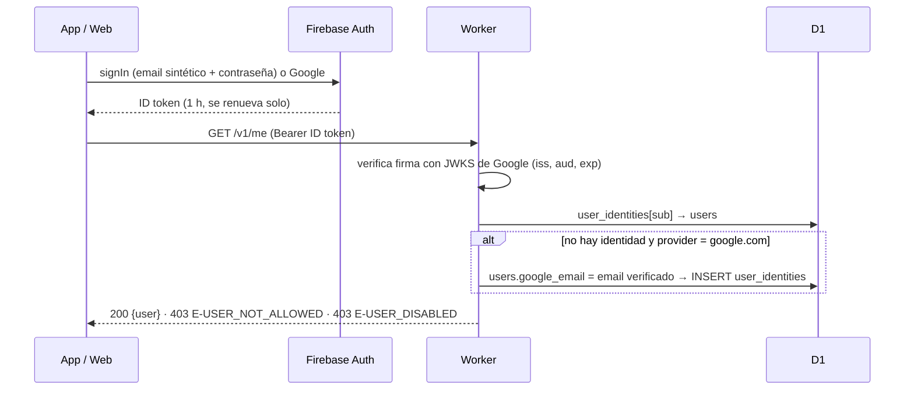

# 02 · Autenticación

Requisitos: RF-AUTH-01 a RF-AUTH-09, RF-ADM-01. Decisiones: T16, T17, T19 y D9 en `ESTADO.md`.

## 1. Resumen

| Método | Cómo lo ve el usuario | Cómo funciona |
|---|---|---|
| Usuario + contraseña | Campos "Usuario" y "Contraseña" | La app convierte `usuario` en `usuario@<SYNTHETIC_EMAIL_DOMAIN>` y usa el proveedor Email/Password de Firebase. Nunca se envía correo a esa dirección |
| Google | Botón "Continuar con Google" | Proveedor Google de Firebase. Solo entra si el correo de Google está en `users.google_email` |

Principios:

- **Firebase guarda y verifica contraseñas.** El Worker nunca ve contraseñas salvo al dar de alta o restablecer (las reenvía a Firebase y no las guarda ni las registra en logs). Así no gastamos CPU del plan Free en hashing.
- **El Worker decide quién entra.** Una cuenta de Firebase sin fila en `user_identities` (o sin correo de Google registrado) recibe `403 E-USER_NOT_ALLOWED`, aunque haya logrado crearse.
- **Un usuario, varias identidades.** Mauricio puede entrar con usuario/contraseña o con Google y es el mismo `users.id`.



## 2. Configuración de Firebase (T-004)

1. Proyecto Firebase (plan gratuito). Apps registradas: Android (`com.maubautista.maunedas`) y Web.
2. Authentication → Sign-in method: habilitar **Email/Password** (sin "link por correo") y **Google**.
3. Si la consola lo ofrece, desactivar la creación de cuentas desde el cliente (User actions → sign-up). Aunque no se pueda, el Worker rechaza cuentas no vinculadas.
4. Authorized domains: agregar `maunedas.<subdominio>.workers.dev` (y `localhost` para desarrollo, viene por defecto).
5. Google Cloud Console → Credenciales → cliente OAuth "Web client (auto created by Google Service)": agregar a *Authorized redirect URIs* `https://maunedas.<subdominio>.workers.dev/__/auth/handler`.
6. Android: registrar SHA-1 y SHA-256 del keystore de debug y del de release. Descargar `google-services.json`.
7. Cuenta de servicio (la de Firebase Admin SDK): generar llave JSON → secreto del Worker `GOOGLE_SERVICE_ACCOUNT`. Se usa para FCM y para Identity Toolkit.

## 3. Usuarios y correo sintético

Regla compartida (`packages/shared/src/auth/username.ts` y `core/model/.../Usernames.kt`, mismos casos de prueba):

```ts
export const SYNTHETIC_EMAIL_DOMAIN_DEFAULT = 'maunedas.local';
export const USERNAME_RE = /^[a-z0-9](?:[a-z0-9._-]{1,30})[a-z0-9]$/;   // 3 a 32 caracteres

export function normalizeUsername(input: string): string {
  return input.normalize('NFKC').trim().toLowerCase();
}

export function assertValidUsername(u: string): void {
  if (!USERNAME_RE.test(u)) throw new Error('USERNAME_INVALID');
}

export function syntheticEmail(username: string, domain = SYNTHETIC_EMAIL_DOMAIN_DEFAULT): string {
  const u = normalizeUsername(username);
  assertValidUsername(u);
  return `${u}@${domain}`;
}
```

- El usuario no se puede cambiar después del alta (cambiaría el correo sintético). El nombre visible sí.
- Contraseña: mínimo 8 caracteres (Firebase exige 6; nosotros validamos 8 antes de llamar).
- **Spike E (T-014):** confirmar que Firebase acepta `@maunedas.local`. Si no, usar un dominio con TLD real que nunca reciba correo y registrar la decisión D9.

## 4. Datos

Tablas en `esquema-d1.sql`: `users` (DOWN, sin correo sintético) y `user_identities` (SERVER).

| Evento | `users` | `user_identities` |
|---|---|---|
| Alta con contraseña | INSERT | INSERT `provider='password'` con el `localId` que devuelve Firebase |
| Alta con Google | INSERT con `google_email` | (se crea en el primer login) |
| Primer login con Google | — | INSERT `provider='google.com'` |
| Desactivar | `active=0` | — (y `disableUser` en Firebase) |

Toda escritura en `users` incrementa `sync_meta.version` y asigna `version` a la fila (es tabla DOWN).

## 5. Worker

### 5.1 Middleware de autenticación (T-021)

```ts
// apps/api/src/auth/middleware.ts
import { createRemoteJWKSet, jwtVerify, type JWTPayload } from 'jose';
import type { MiddlewareHandler } from 'hono';

const JWKS = createRemoteJWKSet(new URL(
  'https://www.googleapis.com/service_accounts/v1/jwk/securetoken@system.gserviceaccount.com',
));

type FirebaseClaims = JWTPayload & {
  email?: string;
  email_verified?: boolean;
  firebase?: { sign_in_provider?: string };
};

export const requireUser = (opts: { admin?: boolean } = {}): MiddlewareHandler<AppEnv> =>
  async (c, next) => {
    const token = c.req.header('Authorization')?.match(/^Bearer\s+(.+)$/)?.[1];
    if (!token) throw new ApiError(401, 'UNAUTHENTICATED');

    let claims: FirebaseClaims;
    try {
      const { payload } = await jwtVerify(token, JWKS, {
        issuer: `https://securetoken.google.com/${c.env.FIREBASE_PROJECT_ID}`,
        audience: c.env.FIREBASE_PROJECT_ID,
        algorithms: ['RS256'],
      });
      claims = payload as FirebaseClaims;
    } catch {
      throw new ApiError(401, 'INVALID_TOKEN');
    }

    const user = await resolveUser(c.env.DB, claims);
    if (!user) throw new ApiError(403, 'USER_NOT_ALLOWED');
    if (!user.active) throw new ApiError(403, 'USER_DISABLED');
    if (opts.admin && user.role !== 'admin') throw new ApiError(403, 'FORBIDDEN');

    c.set('user', user);
    await next();
  };

async function resolveUser(db: D1Database, p: FirebaseClaims): Promise<UserRow | null> {
  const linked = await db
    .prepare(`SELECT u.* FROM user_identities i JOIN users u ON u.id = i.user_id WHERE i.firebase_uid = ?1`)
    .bind(p.sub)
    .first<UserRow>();
  if (linked) return linked;

  if (p.firebase?.sign_in_provider !== 'google.com' || !p.email || p.email_verified !== true) return null;

  const user = await db
    .prepare(`SELECT * FROM users WHERE google_email = ?1`)
    .bind(p.email)
    .first<UserRow>();
  if (!user) return null;

  await db
    .prepare(`INSERT OR IGNORE INTO user_identities (firebase_uid, user_id, provider, created_at)
              VALUES (?1, ?2, 'google.com', ?3)`)
    .bind(p.sub, user.id, Date.now())
    .run();
  return user;
}
```

Notas:
- `createRemoteJWKSet` cachea las llaves en memoria del isolate; la descarga es espera de red, no CPU.
- Opcional si el spike D muestra presión: cache en memoria `Map<sub, {user, exp}>` de 60 s.

### 5.2 Token de Google para servicios (compartido con FCM) (T-022)

```ts
// apps/api/src/google/oauth.ts
import { SignJWT, importPKCS8 } from 'jose';

const SCOPES = [
  'https://www.googleapis.com/auth/firebase.messaging',
  'https://www.googleapis.com/auth/identitytoolkit',
].join(' ');

let memo: { token: string; expMs: number } | null = null;

export async function googleAccessToken(env: Env): Promise<string> {
  const now = Date.now();
  if (memo && memo.expMs - 60_000 > now) return memo.token;

  const cached = await env.DB
    .prepare(`SELECT value, expires_at FROM token_cache WHERE key = 'google_oauth'`)
    .first<{ value: string; expires_at: number }>();
  if (cached && cached.expires_at - 60_000 > now) {
    memo = { token: cached.value, expMs: cached.expires_at };
    return cached.value;
  }

  const sa = JSON.parse(env.GOOGLE_SERVICE_ACCOUNT) as { client_email: string; private_key: string };
  const key = await importPKCS8(sa.private_key, 'RS256');
  const iat = Math.floor(now / 1000);
  const assertion = await new SignJWT({ scope: SCOPES })
    .setProtectedHeader({ alg: 'RS256', typ: 'JWT' })
    .setIssuer(sa.client_email)
    .setSubject(sa.client_email)
    .setAudience('https://oauth2.googleapis.com/token')
    .setIssuedAt(iat)
    .setExpirationTime(iat + 3600)
    .sign(key);

  const res = await fetch('https://oauth2.googleapis.com/token', {
    method: 'POST',
    headers: { 'Content-Type': 'application/x-www-form-urlencoded' },
    body: new URLSearchParams({ grant_type: 'urn:ietf:params:oauth:grant-type:jwt-bearer', assertion }),
  });
  if (!res.ok) throw new ApiError(502, 'UPSTREAM_ERROR', { service: 'google_oauth', status: res.status });
  const { access_token, expires_in } = await res.json<{ access_token: string; expires_in: number }>();

  const expMs = now + expires_in * 1000;
  await env.DB
    .prepare(`INSERT INTO token_cache (key, value, expires_at) VALUES ('google_oauth', ?1, ?2)
              ON CONFLICT(key) DO UPDATE SET value = excluded.value, expires_at = excluded.expires_at`)
    .bind(access_token, expMs)
    .run();
  memo = { token: access_token, expMs };
  return access_token;
}
```

### 5.3 Administración de cuentas en Firebase (T-023)

Identity Toolkit (las mismas rutas que usa el Admin SDK), con el token de §5.2:

| Operación | Llamada |
|---|---|
| Crear cuenta | `POST https://identitytoolkit.googleapis.com/v1/projects/{PROJECT_ID}/accounts` `{email, password, displayName}` → `{localId}` |
| Cambiar contraseña | `POST …/projects/{PROJECT_ID}/accounts:update` `{localId, password}` |
| Desactivar / reactivar | `POST …/projects/{PROJECT_ID}/accounts:update` `{localId, disableUser: true\|false}` |
| Borrar (compensación) | `POST …/projects/{PROJECT_ID}/accounts:delete` `{localId}` |

```ts
// apps/api/src/auth/firebase-admin.ts
export async function firebaseAdmin<T>(env: Env, path: string, body: unknown): Promise<T> {
  const token = await googleAccessToken(env);
  const res = await fetch(
    `https://identitytoolkit.googleapis.com/v1/projects/${env.FIREBASE_PROJECT_ID}/${path}`,
    { method: 'POST', headers: { Authorization: `Bearer ${token}`, 'Content-Type': 'application/json' },
      body: JSON.stringify(body) },
  );
  const json = await res.json<any>();
  if (!res.ok) throw mapIdentityError(json?.error?.message as string | undefined);
  return json as T;
}

function mapIdentityError(msg?: string): ApiError {
  if (msg?.startsWith('EMAIL_EXISTS')) return new ApiError(409, 'USERNAME_TAKEN');
  if (msg?.startsWith('WEAK_PASSWORD')) return new ApiError(400, 'WEAK_PASSWORD');
  if (msg?.startsWith('INVALID_EMAIL')) return new ApiError(400, 'USERNAME_INVALID');
  return new ApiError(502, 'UPSTREAM_ERROR', { service: 'identitytoolkit', message: msg });
}
```

Alta de usuario (`POST /v1/admin/users`, contrato en `03-api.md`):

1. Normalizar y validar `username`; si ya existe en `users` → `409 E-USERNAME_TAKEN` (antes de tocar Firebase).
2. Si trae `google_email` y ya existe → `409 E-GOOGLE_EMAIL_TAKEN`.
3. Si trae `password`: crear cuenta en Firebase → `localId`.
4. Batch en D1: `UPDATE sync_meta` (versión), `INSERT users`, `INSERT user_identities` (si hubo `localId`).
5. Si el batch falla y se creó cuenta en Firebase → `accounts:delete` (compensación) y responder el error.

Restablecer contraseña: buscar identidad `password` del usuario; si no existe, crearla (alta de cuenta con el correo sintético) y vincularla.

Desactivar: `users.active = 0` + `disableUser: true` en cada identidad. Reactivar: lo inverso.

### 5.4 Bootstrap del primer admin (T-024)

```http
POST /v1/bootstrap
X-Bootstrap-Token: <valor del secreto BOOTSTRAP_TOKEN>
Content-Type: application/json

{ "username": "mau", "display_name": "Mauricio", "password": "••••••••", "google_email": "<tu correo de Google>" }
```

| Condición | Respuesta |
|---|---|
| Secreto no configurado o token distinto | `401 E-UNAUTHENTICATED` |
| Ya existe al menos un usuario | `410 E-ALREADY_BOOTSTRAPPED` |
| OK | `201 { "user": { … "role": "admin" } }` |

Después: `wrangler secret delete BOOTSTRAP_TOKEN`.

### 5.5 Proxy de auth para la web (T-025)

```ts
// apps/api/src/auth/proxy.ts — rutas /__/auth/* y /__/firebase/*
export function firebaseAuthProxy(c: Context<AppEnv>) {
  const url = new URL(c.req.url);
  const upstream = new URL(url.pathname + url.search, `https://${c.env.FIREBASE_PROJECT_ID}.firebaseapp.com`);
  return fetch(new Request(upstream, c.req.raw), { redirect: 'manual' });
}
```

En `wrangler.jsonc`, esas rutas van en `assets.run_worker_first` para que no las intercepte la SPA (ver `06-web.md` §6).

## 6. Android (T-110)

### 6.1 Pantalla de login

- Campos: Usuario, Contraseña (con mostrar/ocultar), botón "Entrar".
- Separador "o", botón "Continuar con Google".
- Sin "Crear cuenta". Enlace "¿Olvidaste tu contraseña?" → texto: "Pídele al administrador que la restablezca".

### 6.2 Repositorio

```kotlin
sealed interface LoginResult {
    data class Success(val user: SessionUser) : LoginResult
    data object InvalidCredentials : LoginResult
    data object NotAllowed : LoginResult          // cuenta de Google no registrada
    data object Disabled : LoginResult
    data object Cancelled : LoginResult
    data class Error(val cause: Throwable) : LoginResult
}

class AuthRepository @Inject constructor(
    private val auth: FirebaseAuth,
    private val api: MaunedasApi,
    private val session: SessionStore,              // DataStore: id, username, display_name, role
    private val devices: DeviceRegistrar,           // POST /v1/devices con token FCM
) {
    suspend fun signInWithPassword(username: String, password: String): LoginResult {
        val email = runCatching { Usernames.syntheticEmail(username) }
            .getOrElse { return LoginResult.InvalidCredentials }
        return try {
            auth.signInWithEmailAndPassword(email, password).await()
            finishLogin()
        } catch (e: FirebaseAuthInvalidCredentialsException) {
            LoginResult.InvalidCredentials
        } catch (e: FirebaseAuthInvalidUserException) {
            if (e.errorCode == "ERROR_USER_DISABLED") LoginResult.Disabled else LoginResult.InvalidCredentials
        }
    }

    suspend fun signInWithGoogle(activity: Activity, credentialManager: CredentialManager): LoginResult {
        val option = GetSignInWithGoogleOption.Builder(BuildConfig.GOOGLE_WEB_CLIENT_ID).build()
        val request = GetCredentialRequest.Builder().addCredentialOption(option).build()
        val credential = try {
            credentialManager.getCredential(activity, request).credential
        } catch (e: GetCredentialCancellationException) {
            return LoginResult.Cancelled
        }
        if (credential !is CustomCredential ||
            credential.type != GoogleIdTokenCredential.TYPE_GOOGLE_ID_TOKEN_CREDENTIAL
        ) return LoginResult.Error(IllegalStateException("Credencial inesperada"))

        val idToken = GoogleIdTokenCredential.createFrom(credential.data).idToken
        auth.signInWithCredential(GoogleAuthProvider.getCredential(idToken, null)).await()
        return finishLogin()
    }

    private suspend fun finishLogin(): LoginResult = try {
        val me = api.me()
        session.save(me.user)
        devices.register()
        LoginResult.Success(me.user.toSession())
    } catch (e: ApiException) {
        auth.signOut()
        when (e.code) {
            "USER_NOT_ALLOWED" -> LoginResult.NotAllowed
            "USER_DISABLED" -> LoginResult.Disabled
            else -> LoginResult.Error(e)
        }
    }
}
```

### 6.3 Token en cada request

```kotlin
class AuthInterceptor @Inject constructor(private val auth: FirebaseAuth) : Interceptor {
    override fun intercept(chain: Interceptor.Chain): Response {
        val user = auth.currentUser ?: return chain.proceed(chain.request())
        val token = Tasks.await(user.getIdToken(false), 20, TimeUnit.SECONDS).token
        return chain.proceed(
            chain.request().newBuilder().header("Authorization", "Bearer $token").build()
        )
    }
}

class TokenAuthenticator @Inject constructor(private val auth: FirebaseAuth) : Authenticator {
    override fun authenticate(route: Route?, response: Response): Request? {
        if (response.request.header("X-Auth-Retry") != null) return null   // un solo reintento
        val user = auth.currentUser ?: return null
        val token = Tasks.await(user.getIdToken(true), 20, TimeUnit.SECONDS).token ?: return null
        return response.request.newBuilder()
            .header("Authorization", "Bearer $token")
            .header("X-Auth-Retry", "1")
            .build()
    }
}
```

### 6.4 Sesión offline y cierre

- Al abrir la app: si `auth.currentUser != null` y `SessionStore` tiene usuario → Inicio, sin red (RF-AUTH-08).
- Si una llamada devuelve `USER_DISABLED` o `USER_NOT_ALLOWED`: cerrar sesión (RF-AUTH-07).
- Cerrar sesión: si `outbox` o `pending_uploads` no están vacíos → diálogo "Tienes N cambios sin sincronizar. Si sales, se perderán." Al confirmar: `DELETE /v1/devices/:id` (si hay red), `auth.signOut()`, borrar Room y archivos locales, limpiar DataStore.

## 7. Web (T-160)

```ts
// apps/web/src/lib/firebase.ts
import { initializeApp } from 'firebase/app';
import { getAuth, browserLocalPersistence, setPersistence, signInWithEmailAndPassword,
         signInWithPopup, GoogleAuthProvider } from 'firebase/auth';
import { syntheticEmail } from '@maunedas/shared/auth/username';

const app = initializeApp({
  apiKey: import.meta.env.VITE_FIREBASE_API_KEY,
  projectId: import.meta.env.VITE_FIREBASE_PROJECT_ID,
  appId: import.meta.env.VITE_FIREBASE_APP_ID,
  // En producción el propio Worker hace de authDomain (proxy /__/auth). En dev, el de Firebase.
  authDomain: import.meta.env.DEV
    ? `${import.meta.env.VITE_FIREBASE_PROJECT_ID}.firebaseapp.com`
    : window.location.host,
});

export const auth = getAuth(app);
await setPersistence(auth, browserLocalPersistence);

export const loginWithPassword = (username: string, password: string) =>
  signInWithEmailAndPassword(auth, syntheticEmail(username, import.meta.env.VITE_SYNTHETIC_EMAIL_DOMAIN), password);

export const loginWithGoogle = () => signInWithPopup(auth, new GoogleAuthProvider());
```

- Tras el login, `GET /v1/me`; en `403` se hace `signOut` y se muestra el mensaje.
- Cliente HTTP: `await auth.currentUser?.getIdToken()` en cada request; en `401` fuerza `getIdToken(true)` y reintenta una vez.
- Cambiar contraseña: `reauthenticateWithCredential` + `updatePassword`.

## 8. Mensajes

| Situación | Texto |
|---|---|
| Credenciales incorrectas | "Usuario o contraseña incorrectos." |
| Google no registrado | "Esta cuenta de Google no está registrada. Pídele al administrador que la agregue." |
| Usuario desactivado | "Tu acceso está desactivado. Habla con el administrador." |
| Sin red en el primer login | "Necesitas internet para iniciar sesión la primera vez." |
| Contraseña débil | "La contraseña debe tener al menos 8 caracteres." |

## 9. Pruebas

| Caso | Tipo |
|---|---|
| `normalizeUsername` / `syntheticEmail` con los casos de `fixtures/usuarios.json` en TS y Kotlin | Unit |
| Middleware: token sin firma válida → 401; `iss` o `aud` ajenos → 401; token válido sin identidad → 403; Google con correo registrado → vincula y 200; Google con `email_verified=false` → 403; usuario inactivo → 403 | Unit (Vitest, JWKS simulado con llaves de prueba) |
| Alta: usuario repetido → 409 sin llamar a Firebase; falla D1 tras crear cuenta → se llama `accounts:delete` | Unit con `fetch` simulado |
| Bootstrap: sin secreto → 401; con usuarios → 410; OK → admin creado | Unit |
| Android: login con contraseña, Google, cuenta no registrada, modo avión con sesión previa | Manual (checklist `11-pruebas.md`) |
| Web en Safari de iPhone: login con Google | Manual |
